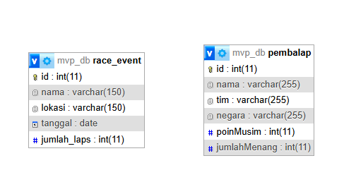
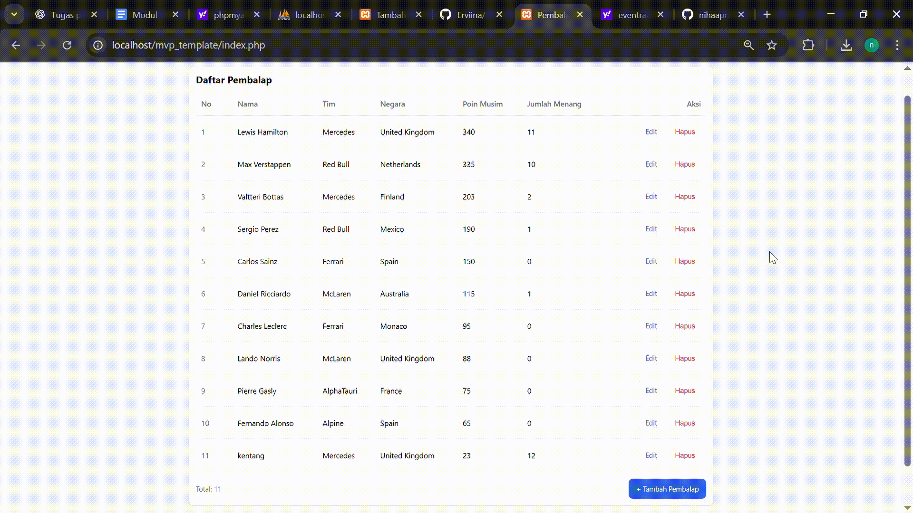
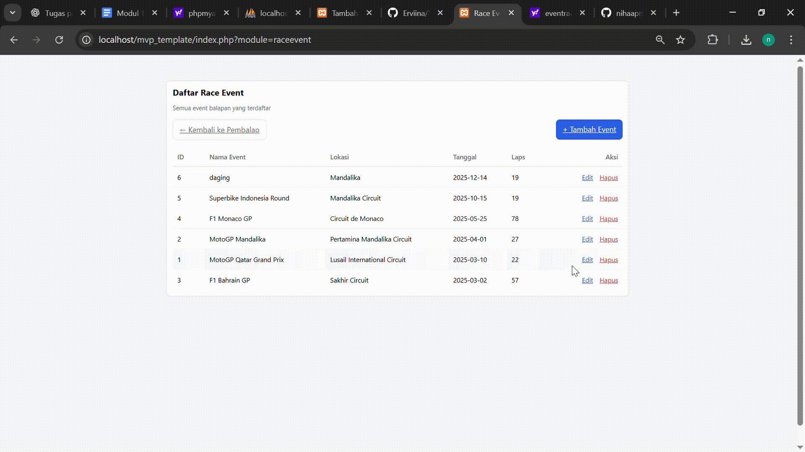

# TP9DPBO2425C2

Saya Niha April Miani dengan NIM 2402567 mengerjakan Tugas Praktikum 9 dalam mata kuliah Desain Pemogramana Berorientasi Objek untuk keberkahanNya maka saya tidak melakukan kecurangan seperti yang telah dispesifikasikan. Aamiin

# Desain Tabel

## 1. Tabel/Class race_event
Tabel ini merepresentasikan data event balapan
- id: Kunci utama, penanda unik untuk setiap event
- nama: Nama event balapan (misalnya: MotoGP Mandalikna, dll)
- lokasi: Tempat atau sirkuit berlangsungnya event
- tanggal: Tanggal pelaksanaan balapan
- jumlah_laps: Jumlah putaran yang harus diselesaikan dalam event tersebut
  
Fungsi utama tabel ini adalah untuk menyimpan detail setiap event balapan yang akan diikuti oleh para pembalap

## 2. Tabel/Class pembalap
Tabel ini merepresentasikan data pembalap 
- id: Kunci utama, identitas unik setiap pembalap
- nama: Nama lengkap pembalap
- tim: Tim tempat pembalap bernaung
- negara: Asal negara pembalap
- poinMusim: Total poin yang dikumpulkan selama satu musim
- jumlahMenang: Jumlah kemenangan pembala
  
Tabel ini berfungsi untuk menyimpan informasi dan statistik performa pembalap

# Desain Program
## A. Model ##
Bagian Model bertanggung jawab untuk:
- Mengelola koneksi ke database
- Menjalankan operasi CRUD (Create, Read, Update, Delete)
- Menyediakan data yang dibutuhkan Presenter
Model terdiri dari modul:
- Data Pembalap
- Data Race Event
Setiap modul memiliki:
- Class untuk representasi objek
- Class untuk akses dan manipulasi database

## B. View ##
View berfungsi untuk:
- Menyajikan tampilan visual kepada pengguna
- Menampilkan tabel data
- Menampilkan form input/edit
  
View hanya fokus pada tampilan (HTML + styling) tanpa logika data.

## C. Presenter ##
Presenter menghubungkan View dan Model.
Tugasnya:
- Mengambil data dari Model
- Mengolah data bila perlu
- Mengirim data ke View
- Menerima aksi user (add/edit/delete)
- Menentukan tampilan mana yang harus dibuka
  
Presenter adalah pengendali utama alur aplikasi.

# Alur Program
## A. Alur Tampilan Data ##
- User membuka halaman aplikasi
- Presenter dipanggil oleh router (index.php)
- Presenter meminta daftar data dari Model
- Model mengambil data dari database
- Presenter mengirimkan data ke View
- View menampilkan tabel yang sudah terisi

## B. Alur Tambah Data ##
- User menekan tombol Tambah
- Presenter memanggil View untuk menampilkan form
- User mengisi form dan menekan Simpan
- Presenter menerima data yang dikirim
- Presenter mengirim perintah ke Model untuk menyimpan
- Model menambah data ke database
- Presenter mengarahkan kembali ke halaman daftar

## C. Alur Edit Data ##
- User memilih menu Edit
- Presenter meminta Model mengambil data berdasarkan ID
- Presenter mengirim data lama ke View (form edit)
- User memperbarui data
- Presenter menerima data baru
- Presenter memerintahkan Model memperbarui database
- User kembali ke halaman daftar

## D. Alur Hapus Data ##
- User memilih menu Hapus
- Presenter menerima ID data
- Presenter memerintahkan Model menghapus data
- Model menghapus dari database
- Presenter menampilkan ulang daftar terbaru

## Kesimpulan ##
- Model: bagian yang berhubungan langsung dengan database
- View: bagian yang menampilkan antarmuka pengguna
- Presenter: pengendali alur yang menghubungkan View & Model

# Dokumentasi
## Pembalap

## Race Event

